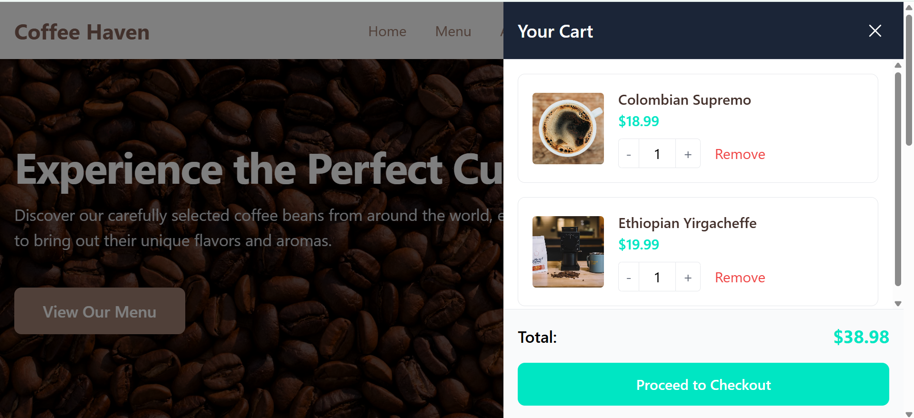

# ☕ Coffee Haven - Modern Coffee Shop Web Application

## Overview 📌
**Coffee Haven** is a modern, responsive coffee shop web application built with React and TypeScript. It offers a seamless experience for customers to browse coffee products, place orders, and explore our coffee culture. The application combines beautiful design with powerful functionality to create an engaging online coffee shopping experience.

---

## Project Design Highlight


---

## Features 📌

### **Shopping Experience**
- 🛒 Interactive shopping cart with local storage persistence
- 💳 Seamless checkout process with receipt generation
- 🌟 Featured products showcase
- 📜 Dynamic menu management
- 🔄 Real-time cart updates

### **User Interface**
- 📱 Responsive design for all devices
- 🎨 Modern UI with Tailwind CSS
- 📱 Mobile-first design approach
- 🌐 SEO-friendly structure

### **Additional Features**
- 🤝 About us and contact pages
- 📋 Product categorization
- 🔍 Search functionality
- 💬 Customer reviews and ratings

---

## Tech Stack 📌

### **Frontend Core**
- React 18.2.0
- TypeScript 5.4.2
- React Router DOM 6.22.3

### **Styling**
- Tailwind CSS 3.4.1
- PostCSS 8.4.35
- Autoprefixer 10.4.18

### **UI Components**
- Hero Icons 2.1.1
- React Icons 5.5.0

### **State Management & UX**
- React Context API
- Local Storage for persistence
- React Hot Toast 2.4.1
- Dynamic loading states
- Error boundaries

### **Development Tools**
- Create React App
- ESLint
- Prettier
- TypeScript Compiler
- npm package manager

---

## Installation Instructions

### Prerequisites
Before you begin, ensure you have the following installed:
- Node.js (v14.0.0 or higher)
- npm (v6.0.0 or higher)
- Git

### Step 1: Clone the Repository
```bash
# Clone the repository
git clone https://github.com/Ejxzdevs/Coffee-Haven.git

# Navigate to the project directory
cd Coffee-Haven
```

### Step 2: Install Dependencies
```bash
# Install all required packages
npm install
```

### Step 3: Set Up Environment (if needed)
```bash
# Copy the example environment file
cp .env.example .env

# Edit the .env file with your configuration
```

### Step 4: Start Development Server
```bash
# Run the development server
npm start
```

### Step 5: Build for Production
```bash
# Create a production build
npm run build
```

---

## Project Structure 📌
```
coffee-haven/
├── public/                 # Static files
│   ├── index.html         # Main HTML file
│   └── assets/            # Images and other assets
├── src/
│   ├── components/        # Reusable UI components
│   ├── context/          # React Context providers
│   ├── pages/            # Page components
│   ├── services/         # Business logic
│   ├── styles/           # Global styles
│   ├── types/            # TypeScript type definitions
│   ├── utils/            # Utility functions
│   └── App.tsx          # Main application component
└── package.json         # Project dependencies and scripts
```

---

## Contributing 📌

We welcome contributions! Please follow these steps:

1. Fork the repository
2. Create your feature branch: `git checkout -b feature/AmazingFeature`
3. Commit your changes: `git commit -m 'Add some AmazingFeature'`
4. Push to the branch: `git push origin feature/AmazingFeature`
5. Open a Pull Request

### Contribution Guidelines
- Write clear, descriptive commit messages
- Update documentation as needed
- Follow the existing code style
- Add comments for complex logic
- Test your changes thoroughly

---

## Credits 🙏

- Built with [React](https://reactjs.org/)
- Developed using [Cursor](https://cursor.sh/) - The AI-first code editor
- Icons from [Hero Icons](https://heroicons.com/) and [React Icons](https://react-icons.github.io/react-icons/)
- UI Components styled with [Tailwind CSS](https://tailwindcss.com/)

---

## Contact & Support 📞

- Creator: Ejxzdevs - [@Ejxzdevs](https://github.com/Ejxzdevs)
- Project Link: [https://github.com/Ejxzdevs/Coffee-Haven](https://github.com/Ejxzdevs/Coffee-Haven)
- Report Issues: [Issue Tracker](https://github.com/Ejxzdevs/Coffee-Haven/issues)

### Support the Project
If you find this project helpful, please give it a ⭐️ on GitHub!

---

Made with ❤️ and ☕ by Ejxzdevs
